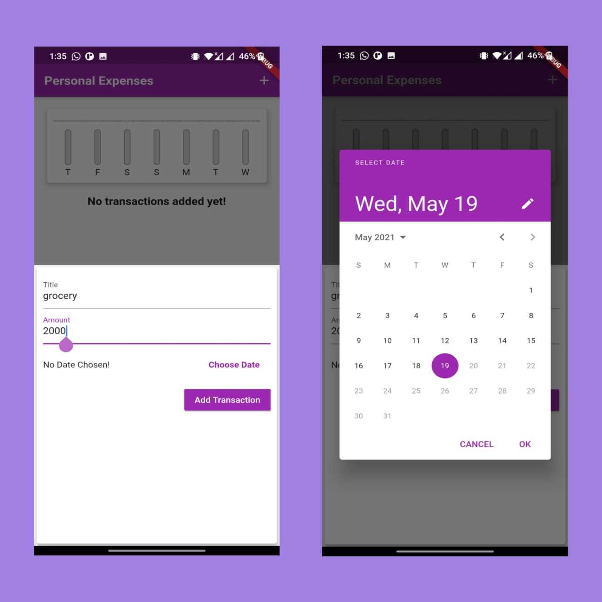
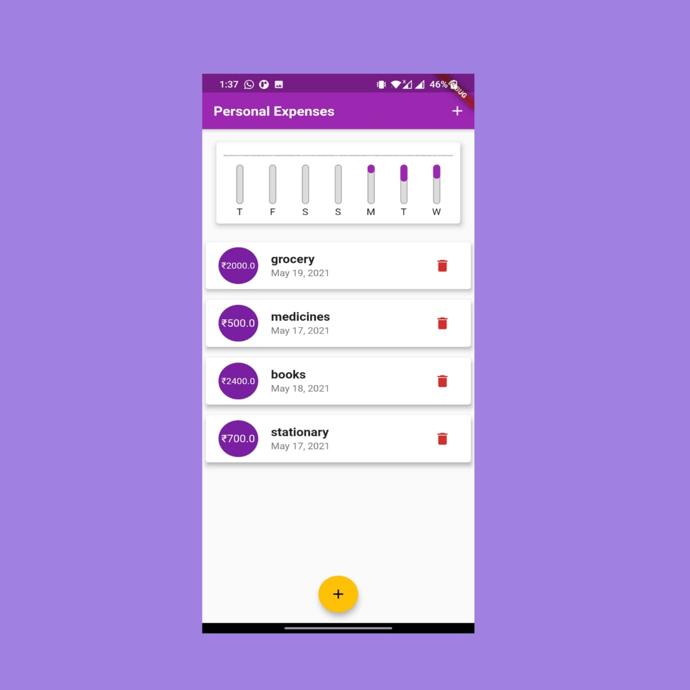

# Budget App(Flutter-App)
<!--A web application for online classroom where you can create your own class or can join someone else's. An online Assignment creation / submission and Grading application. -->

- An application where user can keep a track of his/her expenses by adding, deleting and updating the expenses.It also consists of a graph of comparison of expenses between multiple days.

## Setting up

    flutter pub get
    flutter run

### Screenshots of the project

#### Login and Home Page

#### Application

